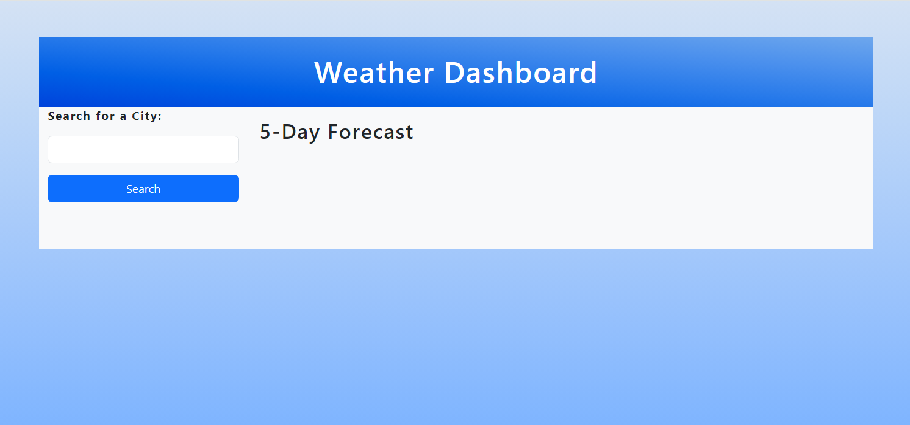
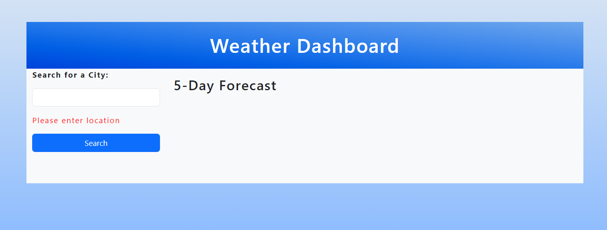
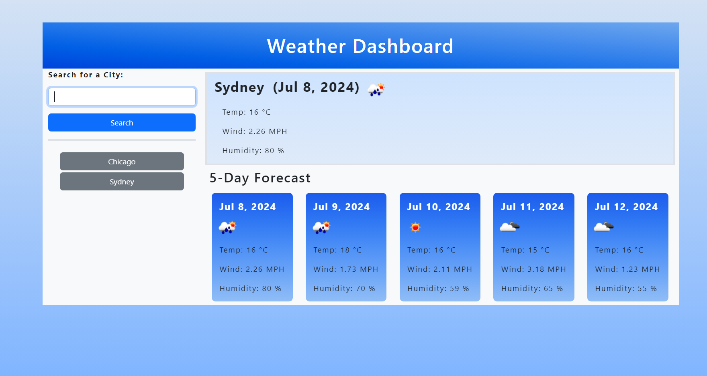
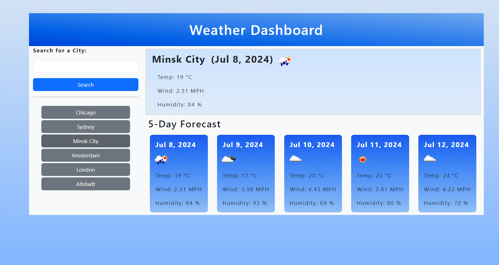

# Weather Dashboard

## Task

In this Challenge I built a weather dashboard that runs in the browser and features dynamically updated HTML and CSS. 

To retrieve weather data for cities I used the [5 Day Weather Forecast](https://openweathermap.org/forecast5) APIs:
- to retrieve geographical coordinates for a given city;
- to retrieve weather forecast for 5 days by geographic coordinates (lat, lon).

## Screenshots

The landing page containing a search input field:
- an error message gets displayed when clicking on Search with no input.

When searching for a city, the current and future weather conditions are displayed for that city and that city is added to the search history:
- the current weather conditions contain the city name, the date, an icon representation of weather conditions, the temperature (in celsius), the humidity, and the wind speed.
- the future weather conditions contain a 5-day forecast that displays the date, an icon representation of weather conditions, the temperature, the wind speed, and the humidity.
- Upon searching for a city, the 5 day forecast for that city is saved in the localStorage.

Clicking on a city in the search history displays the current and future conditions for that city.

## Review

The URL of the deployed application: https://akravt1274.github.io/Challenge-Weather-Dashboard/
